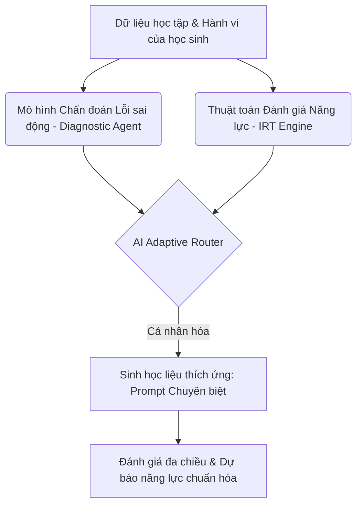
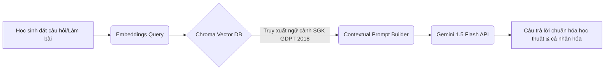
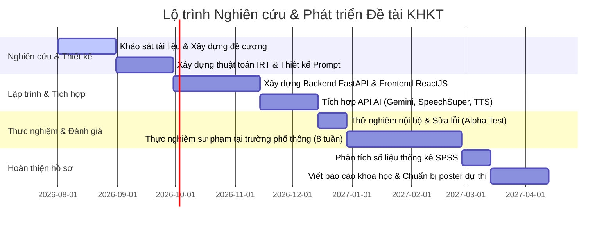

# ĐỀ XUẤT ĐỀ TÀI NGHIÊN CỨU KHOA HỌC KỸ THUẬT (KHKT)
## Nền tảng Gia sư AI Tiếng Anh Cá nhân hóa thích ứng (Adaptive AI English Mentor) dành cho Học sinh lớp 6–12

> [!NOTE]
> Tài liệu này được biên soạn dưới góc nhìn của một Chuyên gia AI, EdTech và Giám khảo KHKT cấp Quốc gia nhằm xây dựng một đề tài nghiên cứu có chiều sâu khoa học, tính mới vượt trội và khả năng triển khai thực tiễn cao.

---

## 1. Đánh giá ý tưởng dưới góc nhìn Giám khảo KHKT

Giám khảo KHKT (đặc biệt ở các vòng cấp Tỉnh/Quốc gia) thường đánh giá đề tài dựa trên 4 trụ cột cốt lõi: **Tính cấp thiết**, **Tính khoa học (Chiều sâu công nghệ)**, **Tính mới (Sự sáng tạo/Sự khác biệt)**, và **Tính thực tiễn (Hiệu quả thực nghiệm)**.

### Điểm mạnh của ý tưởng
* **Tính cấp thiết cao:** Nhu cầu học tiếng Anh của học sinh Việt Nam (đặc biệt là theo chương trình phổ thông mới GDPT 2018 định hướng phát triển năng lực toàn diện) là rất lớn. Việc thiếu môi trường tương tác 1:1 chất lượng cao là bài toán nan giải lâu nay.
* **Đúng xu hướng:** Ứng dụng Generative AI và Adaptive Learning (Học tập thích ứng) đang là mũi nhọn trong nghiên cứu EdTech toàn cầu.

### Thách thức cần giải quyết để đạt giải cao
* **Tránh bẫy "Gọi API đơn thuần" (API Wrapper):** Nếu đề tài chỉ đơn giản là viết một giao diện web, sau đó gửi prompt sang OpenAI/Gemini rồi hiển thị câu trả lời, giám khảo sẽ đánh giá **thấp** về mặt khoa học (không có đóng góp công nghệ riêng, chỉ là tích hợp).
* **Minh chứng khoa học về tính cá nhân hóa:** Làm thế nào AI đo lường được tiến trình của học sinh? Công thức hay thuật toán nào được sử dụng để điều chỉnh độ khó của bài học (ví dụ: áp dụng Thuyết ứng đáp câu hỏi - Item Response Theory (IRT) hay thuật toán lặp khoảng cách Spaced Repetition như SuperMemo-2)?
* **Tính thực chứng:** Cần có số liệu thực nghiệm chứng minh học sinh dùng hệ thống này tiến bộ hơn so với phương pháp thông thường (nhóm đối chứng vs. nhóm thực nghiệm).

---

## 2. Đề xuất các điểm đổi mới (Novelty) để tăng khả năng đạt giải

Để nâng tầm từ một ứng dụng học tập thông thường thành một **Đề tài KHKT đạt giải cao**, chúng ta cần tích hợp các điểm đổi mới mang tính học thuật sau:



1. **Ứng dụng Thuyết ứng đáp câu hỏi (Item Response Theory - IRT) kết hợp với Bayesian Knowledge Tracing (BKT):**
   * *Ý tưởng:* Không chỉ chấm điểm đúng/sai, hệ thống ước lượng mức độ năng lực hiện tại ($\theta$) của học sinh và độ khó ($\beta$), độ phân biệt ($\alpha$) của từng câu hỏi để đưa ra câu hỏi tiếp theo phù hợp nhất (Computerized Adaptive Testing - CAT).
2. **Hệ thống Multi-Agent chẩn đoán lỗi sai sâu theo ngữ cảnh Việt Nam (L1 Interference Diagnostic):**
   * *Ý tưởng:* Học sinh Việt Nam thường mắc các lỗi phát âm và ngữ pháp rất đặc trưng (ví dụ: mất âm cuối "s/z", nhầm lẫn thì, dịch word-by-word từ tiếng Việt). AI Mentor sẽ có một Agent chuyên phân tích lỗi dựa trên sự giao thoa ngôn ngữ Việt-Anh (L1 Interference Analysis), đưa ra giải thích nguyên nhân gốc rễ thay vì chỉ sửa lỗi chung chung.
3. **Mô hình Dự báo kết quả thi chuẩn hóa (IELTS/VSTEP/Thi tốt nghiệp THPT) bằng Machine Learning:**
   * *Ý tưởng:* Sử dụng dữ liệu quá trình học tập để huấn luyện một mô hình hồi quy (Regression) hoặc phân lớp để dự báo điểm số đầu ra của học sinh, giúp học sinh chủ động điều chỉnh chiến lược ôn tập.
4. **Tích hợp cơ chế kiểm soát ảo ảnh AI (AI Hallucination Control in Grammar Correction):**
   * *Ý tưởng:* Xây dựng một quy trình kiểm duyệt chéo (Cross-verification) giữa hai LLM độc lập hoặc giữa LLM và cơ sở dữ liệu luật ngữ pháp cứng (Rule-based NLP như LanguageTool) để đảm bảo AI không giải thích sai kiến thức ngữ pháp cho học sinh.

---

## 3. Những tính năng nên bỏ hoặc giảm tải (Trùng lặp với sản phẩm thương mại)

Các tính năng sau đây rất phổ biến, nếu làm sơ sài sẽ bị so sánh trực tiếp và lép vế trước Elsa Speak hay Duolingo:
* **Chấm phát âm từng từ đơn lẻ (Phoneme-level correction):** Elsa Speak đã làm quá tốt việc này nhờ công nghệ Deep Learning độc quyền huấn luyện trên hàng triệu giọng nói phi bản xứ. Việc cố gắng tự xây dựng bộ so khớp âm vị (Phoneme alignment) từ đầu rất tốn kém và khó đạt độ chính xác tương đương.
  * *Giải pháp:* Thay thế bằng **Đánh giá mức độ lưu loát (Fluency), Trọng âm câu (Sentence Stress), Ngữ điệu (Intonation) và Cách ngắt nhịp (Chunking)** khi đọc một đoạn văn dài.
* **Học từ vựng qua Flashcard cơ bản:** Quá phổ thông (Memrise, Quizlet đã làm tốt).
  * *Giải pháp:* Thay thế bằng **Sinh từ vựng theo ngữ cảnh yêu thích (Contextual Vocabulary Generator)**. AI tự động tạo các câu chuyện hoặc đoạn hội thoại chứa các từ vựng cần học dựa trên sở thích cá nhân của học sinh (ví dụ: học sinh thích Anime, AI sẽ viết đoạn văn tiếng Anh về chủ đề Anime để dạy từ vựng).

---

## 4. Những tính năng đột phá chưa nhiều nền tảng áp dụng

1. **Sinh bài đọc thích ứng theo sở thích và trình độ (Adaptive Reading Generator):**
   * Người dùng nhập một chủ đề họ thích (ví dụ: Robot, bóng đá, Kpop). AI sẽ tự động viết một bài đọc chuẩn ngôn ngữ tự nhiên ở đúng mức độ Lexile (hoặc CEFR từ A1 đến C1) tương thích với trình độ hiện tại của học sinh, kèm theo bộ câu hỏi đọc hiểu được thiết kế theo cấu trúc đề thi phổ thông Việt Nam hoặc IELTS.
2. **Chế độ Luyện nói nhập vai tình huống thực tế (Interactive Role-Play Simulator):**
   * Giả lập các tình huống giao tiếp thực tế như: Đi mua trà sữa, Phỏng vấn xin học bổng, Thuyết trình dự án KHKT... AI đóng vai đối tác giao tiếp, chủ động dẫn dắt cuộc thoại và sau khi kết thúc sẽ cung cấp một **Bản đồ chẩn đoán giao tiếp (Communication Diagnostics Map)** chỉ ra các câu diễn đạt chưa tự nhiên (unnatural phrasing) và gợi ý cách nói tốt hơn.
3. **Trình tạo Bài luận phản biện (Critique Writing Partner):**
   * Học sinh viết một bài luận ngắn. AI không chỉ sửa lỗi chính tả/ngữ pháp mà đóng vai một người tranh biện (Debater), chỉ ra các điểm yếu logic trong lập luận của học sinh và gợi ý các cấu trúc câu phức để nâng cao tính thuyết phục.

---

## 5. Thiết lập Khung đề tài Khoa học Chuyên nghiệp

### A. Tên đề tài chuyên nghiệp
> [!TIP]
> **Tên đề xuất:** *“Nghiên cứu, phát triển hệ thống Gia sư trí tuệ nhân tạo thích ứng (Adaptive AI English Mentor) hỗ trợ cá nhân hóa lộ trình và phát triển toàn diện năng lực tiếng Anh cho học sinh THCS và THPT”*

### B. Mục tiêu nghiên cứu (Research Objectives)
1. **Mục tiêu khoa học:** Nghiên cứu và áp dụng thành công các thuật toán Học tập thích ứng (Adaptive Learning), Thuyết ứng đáp câu hỏi (IRT) kết hợp với các mô hình ngôn ngữ lớn (LLM) để xây dựng giải pháp cá nhân hóa lộ trình học tập.
2. **Mục tiêu kỹ thuật:** Thiết kế và xây dựng thành công nền tảng phần mềm "AI English Mentor" tích hợp các module đánh giá tự động 4 kỹ năng (Nghe, Nói, Đọc, Viết) với độ chính xác tương đương giáo viên bản xứ.
3. **Mục tiêu sư phạm:** Đánh giá hiệu quả thực tế của hệ thống trong việc nâng cao động lực học tập, cải thiện điểm số và khả năng tự học của học sinh THCS và THPT thông qua thực nghiệm sư phạm.

### C. Câu hỏi nghiên cứu (Research Questions)
* **RQ1:** Làm thế nào để ước lượng chính xác và liên tục năng lực tiếng Anh hiện tại của học sinh theo khung năng lực ngoại ngữ 6 bậc dùng cho Việt Nam thông qua các tương tác thời gian thực trên hệ thống?
* **RQ2:** Kiến trúc Multi-Agent kết hợp RAG (Retrieval-Augmented Generation) cần được thiết kế như thế nào để vừa đảm bảo độ chính xác kiến thức học thuật, vừa cá nhân hóa được nội dung học tập theo sở thích cá nhân của từng học sinh?
* **RQ3:** Việc học tập tương tác với hệ thống AI English Mentor có giúp cải thiện kết quả học tập và năng lực giao tiếp tiếng Anh của học sinh lớp 6-12 một cách có ý nghĩa thống kê ($p < 0.05$) so với phương pháp học truyền thống?

### D. Giả thuyết nghiên cứu (Research Hypotheses)
* **H1:** Thuật toán đánh giá thích ứng dựa trên IRT tích hợp trong hệ thống có thể rút ngắn 40% số lượng câu hỏi cần thiết để xác định chính xác trình độ đầu vào của học sinh so với các bài kiểm tra cố định truyền thống.
* **H2:** Việc tích hợp cơ chế chẩn đoán lỗi sai sâu (L1 Interference Diagnostic) giúp học sinh giảm thiểu đáng kể các lỗi ngữ pháp và phát âm mang tính hệ thống sau 8 tuần sử dụng.
* **H3:** Học sinh ở nhóm thực nghiệm (có sử dụng hệ thống AI Mentor) đạt điểm số trung bình kiểm tra định kỳ (kết quả học tập) và mức độ tự tin trong giao tiếp cao hơn rõ rệt so với nhóm đối chứng (chỉ tự học hoặc học theo phương pháp truyền thống).

---

## 6. Thiết kế Kiến trúc Hệ thống & Giải pháp Công nghệ

### A. Sơ đồ kiến trúc tổng thể (System Architecture)

```
+---------------------------------------------------------------------------------+
|                                  USER CLIENT                                    |
|              (ReactJS / Vite App - Giao diện responsive, Web Audio API)        |
+------------------------+--------------------------------+-----------------------+
                         | (HTTPS / WSS)                  |
                         v                                v
+---------------------------------------------------------------------------------+
|                                 GATEWAY & API                                   |
|                             FastAPI Backend Server                              |
+---------------------------------------------------------------------------------+
                         |                                |
                         v                                v
+----------------------------------+    +-----------------------------------------+
|        SERVICE CONTROLLERS       |    |                AI ENGINE                |
| - Authentication & Authorization |    | - Orchestrator (LangChain / LangGraph)  |
| - User Profile & Progress        |    | - Adaptive Router (BKT & IRT Algorithm) |
| - Assessment Database Interface  |    | - Prompt Manager (System Prompts templates)|
+------------------------+---------+    +--------------------+--------------------+
                         |                                   |
                         v                                   v
+---------------------------------------------------------------------------------+
|                                EXTERNAL SERVICES                                |
|  - Gemini 1.5 Flash (Core LLM & RAG) |  - SpeechSuper/Azure Speech (Assessment) |
|  - Azure TTS & Whispers (STT)        |  - ChromaDB (Vector DB for Curriculums)  |
+---------------------------------------------------------------------------------+
```

### B. Mô hình AI phù hợp (AI Model Stack)
* **Mô hình ngôn ngữ lớn (Core LLM):** **Gemini 1.5 Flash** (Dùng cho hầu hết các tác vụ: Sinh bài tập, hội thoại, chấm viết, chẩn đoán lỗi sai nhờ tốc độ xử lý nhanh, cửa sổ ngữ cảnh cực lớn 1M tokens và giá thành cực rẻ/có gói miễn phí).
* **Mô hình Chuyển đổi giọng nói thành văn bản (Speech-to-Text):** **OpenAI Whisper** hoặc **Azure Speech-to-Text** (Để nhận diện chính xác nội dung học sinh nói trong phần Role-Play).
* **Mô hình Chuyển đổi văn bản thành giọng nói (Text-to-Speech):** **Azure TTS** (Có giọng đọc tiếng Anh bản xứ vô cùng tự nhiên với nhiều cảm xúc và ngữ điệu khác nhau).
* **Mô hình Chấm điểm phát âm chi tiết (Pronunciation Assessment):** **SpeechSuper API** hoặc **Azure Pronunciation Assessment** (Cung cấp điểm số chi tiết cho từng âm vị, độ lưu loát, trọng âm).

### C. Công nghệ lập trình & Cơ sở dữ liệu
* **Backend:** **Python** kết hợp với **FastAPI** (Lựa chọn tối ưu để làm việc với các thư viện AI/Machine Learning, hỗ trợ xử lý bất đồng bộ Async giúp tối ưu hóa luồng Streaming dữ liệu âm thanh/văn bản).
* **Frontend:** **ReactJS** sử dụng **Vite** làm build tool, kết hợp với thư viện UI như **Tailwind CSS** và **Shadcn/ui** để tạo giao diện sang trọng, mượt mà.
* **Cơ sở dữ liệu:**
  * **Relational Database (SQL):** **PostgreSQL** để quản lý thông tin người dùng, lịch sử học tập, cấu trúc bài học, điểm số.
  * **Vector Database:** **ChromaDB** hoặc **Qdrant** (Lưu trữ các phân đoạn bài giảng, dữ liệu sách giáo khoa tiếng Anh lớp 6-12 phục vụ cho cơ chế RAG).

### D. Quy trình huấn luyện & Tinh chỉnh (RAG & Fine-Tuning Workflow)

Đối với một dự án học sinh THCS/THPT, việc **Fine-tuning** toàn bộ một LLM là quá tốn kém và dễ gây ra hiện tượng quên lãng tri thức (catastrophic forgetting). Giải pháp thay thế khoa học và hiệu quả nhất là **RAG (Retrieval-Augmented Generation)** kết hợp với **Few-shot Prompting**.



1. **Chuẩn bị cơ sở dữ liệu tri thức (Knowledge Base):** Số hóa toàn bộ sách giáo khoa Tiếng Anh (Chương trình mới GDPT 2018 từ lớp 6-12), bộ đề thi tốt nghiệp THPT, hướng dẫn chấm thi viết/nói của IELTS/VSTEP.
2. **Chunking & Vectorization:** Cắt nhỏ tài liệu thành các đoạn thông tin hữu ích và chuyển đổi thành Vector (sử dụng model `text-embedding-004` của Google) sau đó lưu vào ChromaDB.
3. **Thiết kế System Prompt chuyên biệt (Prompt Engineering):** Định hình tính cách cho AI Mentor (Kiên nhẫn, khuyến khích học sinh, giải thích theo phương pháp sư phạm: gợi mở trước khi đưa ra đáp án trực tiếp).

---

## 7. Quy trình Đánh giá Hiệu quả bằng Thực nghiệm Sư phạm

Đây là phần cực kỳ quan trọng để thuyết phục giám khảo rằng công trình của bạn không chỉ là "code cho vui" mà thực sự có tác động tích cực đến giáo dục.

* **Phương pháp nghiên cứu:** Thực nghiệm sư phạm bán thực nghiệm (Quasi-experimental design).
* **Đối tượng:** Chọn 2 lớp học tương đương về trình độ tiếng Anh ở một trường THCS hoặc THPT (ví dụ: lớp 10A1 và 10A2).
  * **Nhóm thực nghiệm (Experimental Group - Lớp 10A1):** Học tiếng Anh kết hợp luyện tập trên ứng dụng AI English Mentor (30 phút/ngày sau giờ học).
  * **Nhóm đối chứng (Control Group - Lớp 10A2):** Học tiếng Anh theo phương pháp tự học truyền thống hoặc làm bài tập giấy.
* **Thời gian thực nghiệm:** 8 - 12 tuần.
* **Các bước đo lường:**
  1. **Pre-test:** Cho cả 2 nhóm làm chung một đề kiểm tra đánh giá năng lực 4 kỹ năng trước thực nghiệm để chứng minh trình độ xuất phát điểm tương đương ($p > 0.05$).
  2. **Quá trình thực nghiệm:** Ghi nhận nhật ký tương tác (log data) của học sinh nhóm thực nghiệm trên hệ thống (thời gian học, số lỗi sai giảm dần, mức độ tương tác).
  3. **Post-test:** Thực hiện bài kiểm tra đánh giá sau thực nghiệm.
  4. **Phân tích dữ liệu:** Sử dụng phần mềm thống kê (SPSS hoặc thư viện `scipy.stats` trong Python) để thực hiện kiểm định **Independent Samples t-test** nhằm so sánh điểm số của hai nhóm. Chỉ số p-value < 0.05 sẽ khẳng định sự tiến bộ của nhóm thực nghiệm là do tác động của phần mềm chứ không phải do ngẫu nhiên.
  5. **Khảo sát định lượng (Likert Scale):** Phát phiếu khảo sát mức độ hài lòng, động lực học tập theo thang đo Likert 5 mức độ để đánh giá trải nghiệm người dùng.

---

## 8. So sánh định vị sản phẩm (Competitor Analysis)

| Tiêu chí | Duolingo | Elsa Speak | ChatGPT / Gemini (Bản Free) | **Đề xuất: Adaptive AI English Mentor** |
| :--- | :--- | :--- | :--- | :--- |
| **Công nghệ cốt lõi** | Gamification, bài tập điền khuyết cố định. | Nhận diện giọng nói chuyên sâu từ đơn lẻ. | Sinh văn bản tự do, dễ bị ảo ảnh (hallucination). | **Multi-Agent AI + RAG SGK GDPT + IRT Adaptive Algorithm.** |
| **Độ bám sát chương trình học phổ thông** | Rất thấp (học từ vựng chung chung). | Trung bình (giao tiếp chung). | Thấp (không tự động cập nhật kiến thức SGK Việt Nam). | **Tuyệt đối (RAG tích hợp trực tiếp kiến thức SGK lớp 6-12).** |
| **Khả năng Cá nhân hóa** | Tuyến tính, thuật toán lặp khoảng cách đơn giản. | Tập trung sửa phát âm, không xây dựng lộ trình toàn diện. | Không có bộ nhớ dài hạn, không tự động sinh bài tập theo trình độ thực tế. | **Cá nhân hóa thích ứng động: Tự động điều chỉnh độ khó bài học dựa trên lý thuyết IRT.** |
| **Khả năng chẩn đoán lỗi** | Chỉ báo đúng/sai. | Chỉ ra ký tự phát âm sai. | Chỉ ra lỗi ngữ pháp cơ bản, không phân tích nguyên nhân gốc rễ (L1 Interference). | **Bản báo cáo chẩn đoán đa chiều: Phân tích sâu nguyên nhân lỗi sai do thói quen ngôn ngữ Việt.** |

---

## 9. Lộ trình phát triển đề tài (6 - 12 tháng)



---

## 10. Tư vấn và So sánh các API AI tối ưu chi phí cho dự án KHKT

Đối với một dự án học sinh tham gia KHKT có ngân sách giới hạn, việc lựa chọn API cần thỏa mãn sự cân bằng giữa chất lượng và chi phí tối thiểu.

### A. Bảng so sánh chi tiết các API theo tác vụ

| Tác vụ | Gợi ý API hàng đầu | Ưu điểm | Nhược điểm | Chi phí | Khuyến nghị cho dự án KHKT |
| :--- | :--- | :--- | :--- | :--- | :--- |
| **Chat AI & Sinh bài tập** | **Gemini 1.5 Flash** | Tốc độ cực nhanh, Context window lớn (1M tokens), hỗ trợ đa phương thức tốt. | Đôi khi có thể trả về câu trả lời không ổn định nếu prompt không chặt chẽ. | **Miễn phí** (ở mức giới hạn Rate limit khá rộng: 15 RPM, 1 triệu TPm). | **Khuyên dùng số 1** (Miễn phí và dư dùng cho chạy thử nghiệm). |
| | **OpenAI GPT-4o-mini** | Tính logic cực tốt, phản hồi ổn định về cấu trúc JSON. | Không có gói miễn phí chính thức dài hạn. | Rất rẻ ($0.150 / 1M input tokens). | Dùng dự phòng nếu Gemini gặp lỗi định dạng JSON. |
| **Chấm phát âm & Speaking** | **SpeechSuper API** | Đánh giá cực kỳ chi tiết (Phoneme, Stress, Fluency, Pronunciation). Hỗ trợ chấm nói IELTS. | Tài liệu tích hợp hơi khó tiếp cận hơn Azure. | Cấp free trial ban đầu, sau đó tính phí theo lượt gọi. | **Khuyên dùng cho tính năng chuyên sâu** vì cung cấp API đánh giá Speaking kiểu IELTS rất độc đáo. |
| | **Azure Pronunciation Assessment** | Chất lượng chuẩn doanh nghiệp, tích hợp sẵn trong Azure SDK, có giọng đọc bản xứ. | Phải đăng ký tài khoản Azure qua thẻ tín dụng. | Có gói F0 (Miễn phí 5 giờ âm thanh/tháng). | **Khuyên dùng số 1** vì gói F0 cực kỳ hào phóng cho dự án học sinh. |
| **Speech-to-Text (STT)** | **Whisper (via Groq Cloud)** | **Tốc độ siêu nhanh (nhanh gấp 10 lần OpenAI)**, nhận diện tiếng Anh cực chuẩn. | Phải đăng ký thêm một dịch vụ trung gian (Groq). | **Miễn phí hoàn toàn** ở thời điểm hiện tại (Beta rate limits). | **Khuyên dùng số 1** nhờ tốc độ phản hồi tức thì và miễn phí. |
| | **OpenAI Whisper API** | Rất ổn định, xử lý được âm thanh chất lượng kém. | Tính phí. | $0.006 / phút âm thanh. | Dự phòng. |
| **Text-to-Speech (TTS)** | **Azure Text-to-Speech** | Giọng đọc tự nhiên bậc nhất thế giới, hỗ trợ SSML để tùy chỉnh cảm xúc, tốc độ. | Cần cấu hình Azure Resource. | Miễn phí 0.5 triệu ký tự/tháng (Gói F0). | **Khuyên dùng số 1** cho các bài luyện nghe tự động. |
| | **Google Cloud TTS** | Dễ tích hợp với Python. | Giọng nói bản xứ ở bản standard hơi robot, bản WaveNet có tính phí. | Miễn phí 4 triệu ký tự/tháng (Standard). | Tốt cho các phát âm từ đơn giản. |

### B. Chiến lược tối ưu chi phí (Zero-Budget Strategy) cho dự án
1. **Core Processing:** Sử dụng **Gemini 1.5 Flash** cho toàn bộ logic sinh nội dung, chẩn đoán ngữ pháp và tương tác hội thoại. Tận dụng gói miễn phí của Google AI Studio.
2. **Audio Processing (STT):** Sử dụng **Groq Cloud API** để gọi mô hình Whisper. Tốc độ chuyển đổi giọng nói thành văn bản của Groq đạt gần như tức thì, giúp trải nghiệm giao tiếp không bị trễ.
3. **Phát âm & Nói:** Đăng ký tài khoản học sinh/sinh viên Azure để nhận gói **Free 12 tháng** và sử dụng gói F0 của **Azure Speech Service** (chấm phát âm và phát giọng đọc chất lượng cao).
4. **Hệ thống chạy local hoặc deploy free:** Khi demo hoặc thử nghiệm, backend có thể chạy trên máy tính cá nhân local, hoặc deploy lên **Render.com** (miễn phí), frontend deploy lên **Vercel** (miễn phí).
